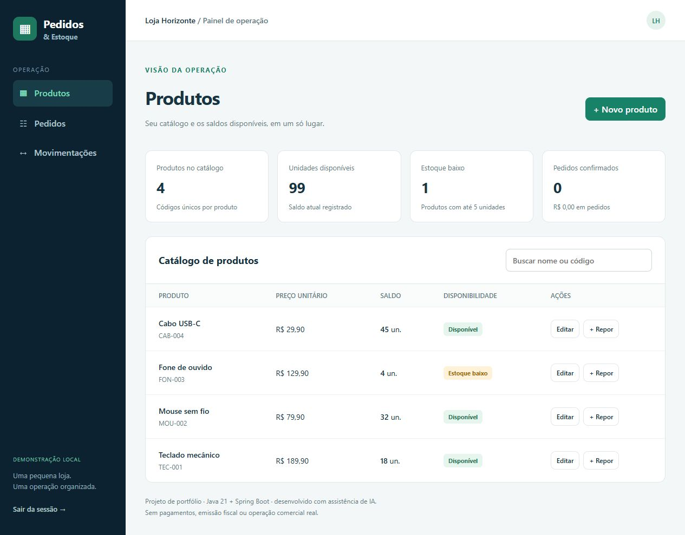

# Pedidos & Estoque

Aplicação de portfólio para uma pequena loja: catálogo, pedidos e histórico de movimentações, com interface web e regras persistidas no banco.

> Desenvolvido com assistência de IA. Os dados da Loja Horizonte são fictícios. Este projeto foi publicado **somente como código no GitHub**; a interface roda localmente.



## Funcionalidades

- Login e acesso autenticado às operações da API.
- Cadastro e edição de produtos, com SKU único e preços decimais.
- Reposição de estoque com registro no histórico.
- Pedidos com vários itens, salvos inicialmente como rascunho.
- Confirmação que verifica e baixa todos os itens em uma transação.
- Cancelamento que devolve o estoque de pedidos confirmados uma única vez.
- Busca, alertas de estoque baixo e últimas 100 movimentações.
- Interface adaptada para celular.

## Regras que protegem o estoque

Um rascunho não reserva nem debita unidades. A confirmação bloqueia as linhas dos produtos em ordem de ID e verifica os saldos. Se algum item faltar, **toda a operação é revertida**.

Repetir a confirmação ou o cancelamento não duplica a movimentação. Itens repetidos no mesmo pedido são agregados. Nome e preço ficam registrados no item do pedido, preservando seu histórico após alterações no catálogo.

Limites: até 30 itens por pedido, até 9.999 unidades por produto no pedido e saldo máximo de 1.000.000 unidades.

## Tecnologias

Java 21 · Spring Boot 4.1 · Spring MVC · Spring Security · JPA/Hibernate · Flyway · H2 · PostgreSQL · JUnit 5

A interface utiliza HTML, CSS e JavaScript sem dependências externas. Valores monetários e totais são calculados no servidor com `BigDecimal`.

## Executar a demonstração

Requisitos: Java 21 e Maven 3.9 ou superior.

```sh
git clone https://github.com/JLemosDev/pedidos-estoque.git
cd pedidos-estoque
mvn spring-boot:run
```

Abra **http://localhost:8081**. No modo local padrão:

- Usuário: `demo`
- Senha fictícia: `demo12345`
- Banco H2 persistido em `data/estoque`

A aplicação escuta apenas em `127.0.0.1` por padrão. Os quatro produtos de exemplo são criados somente no primeiro uso do perfil `demo`. O diretório de dados não vai para o GitHub.

As credenciais acima pertencem à demonstração. Não as utilize em um ambiente acessível pela internet.

## Testes e pacote

```sh
mvn verify
java -jar target/pedidos-estoque-1.0.0.jar
```

Os testes de integração usam banco H2 isolado. Cobrem concorrência na venda da última unidade, reversão de pedidos com saldo insuficiente, idempotência de confirmação/cancelamento, preservação de preços, itens duplicados, reposição e SKU único.

## PostgreSQL

O perfil `postgres` utiliza as variáveis abaixo, sem valores secretos no repositório:

| Variável                | Uso                                                   |
| ----------------------- | ----------------------------------------------------- |
| SPRING_PROFILES_ACTIVE  | postgres                                              |
| DB_URL                  | URL JDBC do PostgreSQL                                |
| DB_USER / DB_PASSWORD   | Credenciais do banco                                  |
| APP_USER / APP_PASSWORD | Usuário e senha da aplicação (mínimo de 8 caracteres) |
| SERVER_ADDRESS          | Endereço de escuta; padrão local                      |
| PORT                    | Porta HTTP; padrão 8081                               |

As migrações Flyway ficam em `src/main/resources/db/migration`. Nunca substitua uma migração já aplicada; crie a próxima versão.

## API

Todas as rotas `/api/**` exigem HTTP Basic.

| Método     | Rota                           | Operação                |
| ---------- | ------------------------------ | ----------------------- |
| GET / POST | /api/produtos                  | Listar / cadastrar      |
| PUT        | /api/produtos/{id}             | Editar nome e preço     |
| POST       | /api/produtos/{id}/reposicoes  | Repor unidades          |
| GET        | /api/produtos/movimentacoes    | Histórico               |
| GET / POST | /api/pedidos                   | Listar / criar rascunho |
| POST       | /api/pedidos/{id}/confirmacao  | Confirmar               |
| POST       | /api/pedidos/{id}/cancelamento | Cancelar                |

Erros de entrada retornam 400; registros inexistentes, 404; conflitos de saldo ou estado, 409. A interface mantém a autenticação somente em memória e exige novo login após recarregar.

## Limites

Projeto local de portfólio, com um único usuário administrativo. Não inclui pagamento, emissão fiscal, múltiplas lojas, fornecedores ou permissões por função. Cancelar é uma operação definitiva nesta versão.

Uma implantação real exigiria HTTPS, autenticação adequada ao ambiente, proteção adicional contra abuso, backups, paginação e observabilidade. HTTP Basic sem HTTPS deve permanecer restrito à demonstração local. PostgreSQL é uma opção configurada; os testes executados nesta entrega utilizaram H2.

## Organização

`api`: contratos e controllers · `service`: transações e regras · `model`: entidades · `repository`: consultas e bloqueios · `config`: segurança e dados de exemplo · `static`: interface.

## Contato

[JLemosDev no GitHub](https://github.com/JLemosDev) · lemosjoaovitorlemos@gmail.com
